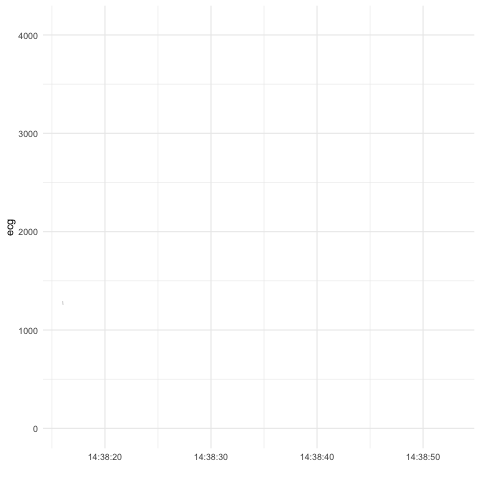

<!-- README.md is generated from README.Rmd. Please edit that file -->
beats
=====

Overview
--------

`beats` reads, visualizes, and process ECG data from UFI devices.

Installation
------------

``` r
# Install the development version from GitHub:
# install.packages("devtools")
devtools::install_github("FlukeAndFeather/beats")
```

Usage
-----

This example reads a binary UBE file and launches a Shiny app for finding heart beats.

``` r
# File path to sample data
fp <- system.file("extdata", "max_ecg_190826b.ube", package = "beats")
# Read ube file
ecg_data <- read_ube(fp)
# Launch GUI
heartbeats <- find_hr(ecg_data)
# In this heart rate profile, zoom into 12:53:20 - 12:54:25 to see actual beats
```

After identifying heart beats in ECG profile, you can create a GIF showing them in real time.

``` r
animate_hr(ecg_bw190918_62R, beats_bw190918_62R, which_beats = 44:50, big = TRUE)
```


